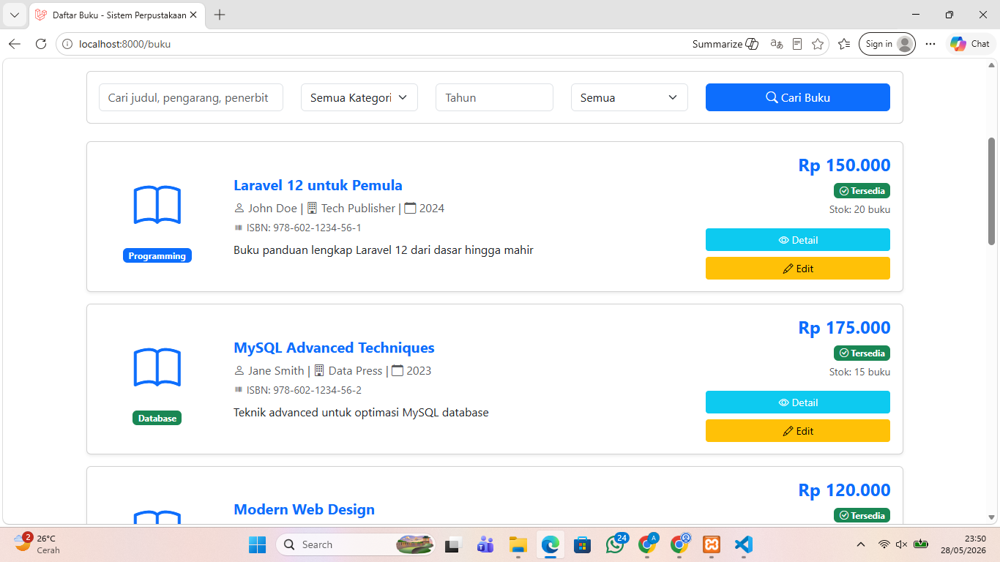
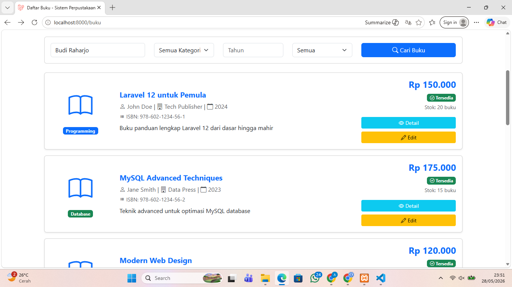
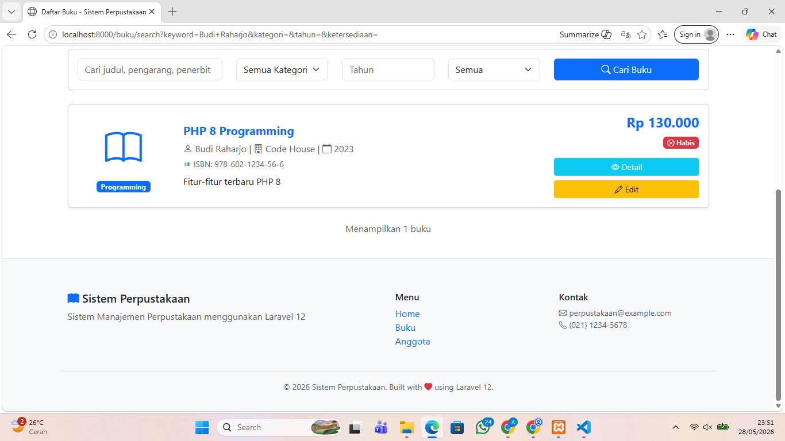

# Tugas Pertemuan 11 - Dashboard, Blade Component, dan Search Filter Laravel

**Nama:** Ramona Aprilia Yuniar  
**NIM:** 60324039  
**Prodi:** Informatika  
**Semester:** 4  
**Repository:** [https://github.com/USERNAME/NAMA-REPOSITORY.git]

---

# Tugas 1 - Membuat Halaman Dashboard

## Tujuan
Membuat halaman dashboard yang menampilkan ringkasan statistik perpustakaan.

---

## Perintah yang dijalankan:

- `php artisan make:controller DashboardController`
- Menambahkan route dashboard
- Membuat view dashboard
- Menampilkan statistik buku dan anggota

---

## Data yang Ditampilkan

- Total buku
- Buku tersedia
- Buku habis
- Total anggota
- Anggota aktif
- Anggota nonaktif
- 5 buku terbaru
- 5 anggota terbaru
- Quick links menu utama
---

## Screenshot

### 1. Halaman Dashboard


---

# Tugas 2 - Blade Component Buku Card

## Tujuan
Membuat Blade Component reusable untuk card buku.

---

## Perintah yang dijalankan:

- `php artisan make:component BukuCard`

---

## Component yang Digunakan

```blade
<x-buku-card :buku="$buku" />
```

---

## Isi Component

- Icon buku
- Judul buku
- Pengarang
- Harga
- Badge kategori
- Status stok
- Tombol detail
- Tombol edit

---

## Screenshot

### 1. Hasil Blade Component Buku Card


---

# Tugas 3 - Search & Filter Buku Advanced

## Tujuan
Menambahkan fitur pencarian dan filter advanced pada halaman buku.

---

## Fitur Search

- Search judul
- Search pengarang
- Search penerbit

---

## Filter

- Kategori
- Tahun terbit
- Ketersediaan buku

---

## Screenshot

### 1. Form Search Buku


### 2. Contoh Search Berdasarkan Nama Pengarang


### 2. Hasil Search 

